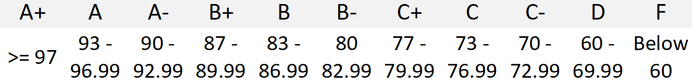

# UCSD CSE 8A Spring 2024
## Basic Data Structures and Object-Oriented Design

_Greg Miranda_

This web page serves as the main source of announcements and resources for the
course, as well as the syllabus.

## Course description

Welcome to CSE 8A! We are excited to have you in this course. In this class, our goal is to help you experience the thrill of getting a computer to solve a problem of your choosing – by expressing that solution in a programming language. In this course you will do interactive in-class exercises and programming assignments to help you master the basics of computational problem solving and programming.

## Prerequisites

CSE 8A is designed for students with no prior programming experience.   We do not expect you to have any prior programming experience, just a willingness to learn.

## Learning outcomes

Students who successfully complete CSE 8A will be able to:
- Read a computational problem and formulate an algorithm to solve that problem
- Describe the functionality of a program that you or someone else has written 
- Write simple Python programs using variables, functions, conditional statements, and loops
- Store data in a  program using data structures like lists, tuples, and dictionaries
- Use memory models to trace the state of data during a program’s execution
- Debug and test Python programs that you or someone else has written
- Describe ways in which computer science plays a role in society and in other scientific disciplines 

## Course Resources

<h3>Textbooks</h3>

THERE IS **NO REQUIRED TEXTBOOK** FOR THIS COURSE!

We will be using the following freely available online resources

- *Course Textbook (on Stepik)*

  Link: [https://stepik.org/course/100726/syllabus](https://stepik.org/course/100726/syllabus ){:target="_blank"}

- *Automate The Boring Stuff With Python* by Al Sweigart

  Link: [https://automatetheboringstuff.com/](https://automatetheboringstuff.com/){:target="_blank"}

- *Think Python (2nd Edition)* by Allen B. Downey

  Link to pdf version:  [http://greenteapress.com/thinkpython2/thinkpython2.pdf](http://greenteapress.com/thinkpython2/thinkpython2.pdf){:target="_blank"}

  Link to html version: [http://greenteapress.com/thinkpython2/html/index.html](http://greenteapress.com/thinkpython2/html/index.html){:target="_blank"}

**NOTE**: You need NOT purchase any textbook for this course! Readings will be assigned from the above **FREE ONLINE TEXTBOOKS** and other online sources.

<h3>Course Website</h3>

The course webpage contains basic information, syllabus (that you are reading right now!),  schedule (including office/lab hours), materials (notes, slides, etc) and staff contact information. You should check our course website often!

<h3>Canvas</h3>

We will be using [Canvas](http://canvas.ucsd.edu){:target="_blank"} for publishing your grades for this course. The grades you see on canvas are YOUR OFFICIAL GRADE, and it is your responsibility to CHECK THEM REGULARLY to make sure they are recorded correctly.

<h3>Gradescope</h3>

You will use [Gradescope](http://www.gradescope.com){:target="_blank"} for submitting your programming assignments. We will use Gradescope for grading your PAs and exams. You will be added to our course on Gradescope automatically sometime during week 1.

<h3>Piazza</h3>

We will use **Piazza** as our course discussion board.  Please ask all course content related questions via piazza.  Make your post public unless it contains personal information.  This will help you get the fastest response possible to your post. DO NOT POST YOUR CODE as a public post on piazza as it will be considered as an Academic Integrity (AI) violation.

See [Questions page](/staff-and-help.html) for more information on using Piazza and other ways to get help in the course.

## Course Components

There are a few components to your grade in the course:

- Programming assignments (40%)
- Stepik Exercises (i.e. Review Quizzes/RQs): 20% (10 RQs)
- Lab Assignments: 10%
- 30% Exams
  - 10% Midterm Exam
  - 20% Final Exam
- Extra Credit: 10% Lecture/Discussion Participation

Letter grades will be assigned based on the following grading scale:

{:width="100%"}

We may adjust the above scale to be more lenient 
(depending on a number of factors that we will not publicize), but we guarantee 
that we will not adjust the scale to make it harder to get a better grade. 
We will not adjust the scale for individual students. We will not round grades up. 

<h3>Lectures</h3>

Most course content will be presented asynchronously through videos and readings, 
with associated interactive activities which should be completed before lecture. 

Lectures will involve problem solving with your classmates along with an opportunity
to ask quesitons about the material. 

It is very important that students watch all pre-lecture videos as this is the 
primary way to learn the CSE 8A material. 

**In-person lectures** will be led during the normally-scheduled lecture times
in the normally-scheduled room, led by the instructor. These sessions will be
recorded by podcasting but will not be available remotely while they are ongoing. 
You can find the recordings in the Canvas Media Gallery or at [podcast.ucsd.edu](https://podcast.ucsd.edu){:target="_blank"}

Since these lectures may be mostly student discussion, the recordings are mostly 
an archive of any live demos that come up rather than a presentation of core content.
If you miss lecture, or miss the start of lecture, you should watch the first few minutes 
of each lecture to see any annoucements. Not all annoucements are made on Piazza.

<h3>Discussion</h3>

**In-person discussion** will reinforce concepts from class and pracice exam questions. 
Discussions are also an opporunity to ask questions about the assignments as well as 
the course material. 

Discussions will also be recorded by podcasting but will not be available remotely while they are ongoing. 
You can find the recordings in the Canvas Media Gallery or at [podcast.ucsd.edu](https://podcast.ucsd.edu){:target="_blank"}

<h3>Lecture/Discussion Participation (Extra Credit)</h3>

Starting with the second lecture, we will take attendance during lecture (except exams) and for each discussion session.

Attendance for lectures and discussions is not required, but attendance at each lecture/discussion earns
0.4% extra credit, up to a maximum of 10% (25 total lectures and/or discussions). Please note that there are 25 lectures and 10 discussions, for 35 opportunities to earn extra credit. 

In each lecture/discussion, we’ll have a paper handout (also available electronically). 
At the end of lecture/discussion you’ll have a chance submit your handout to Gradescope. 
You can do this by scanning it in the Gradescope app (for iOS and Android) 
or through the web interface. To get participation credit, you 
have to submit a handout filled in with the code provided by the instructor/TA.

The correct code for the lecture/discussion (given by the instructor or TA) 
must be used or credit will not be given for attending. Handouts will be 
graded for participation only and not for correctness of the response.

We will not accept any check-ins after lecture and credit for attendance 
will not be given retroactively.

<h3>Lab Assignments</h3>

Every week, there will be a mandatory 1 hour lab session. There will be a lab assignment that will be due at the end of every lab session. Attendance will be checked. You must attend the lab section you signed up for.

**You must score at least 50% (average) on the lab assignments of this course. If you average lower than 50% on the lab assignments, you will receive an F for the course, regardless of your overall average.**

### Stepik Exercises (Textbook) (i.e. Reading Quizzes/RQs)

To prepare you for these interactive class sections, there will be reading assignments and exercises to be completed before almost every class session. At the end of each week, there will be a Stepik Exercises, which will be due at 8:00 AM PT (Pacific Time) on Saturdays. 

The [Stepik textbook](https://stepik.org/course/100726/syllabus){:target="_blank"} will cover topics from the reading assignments, lecture videos, and lecture discussion. You have to ensure that you do the readings and attend/watch lectures before doing the exercises. You will find a link to the required Stepik chapters for the lecture on the lecture page. 

The Stepik exercises will be on Stepik. You should create a Stepik ID to access the readings and exercises. We will provide a form to capture your Stepik ID (a ~9 digit number that can be found in your Stepik profile). The Stepik exercises must be done individually. There will be 10 RQs in total and you can attempt the Stepik exercises multiple times until you get them correct! 

The online texbook records your progress, and we give a schedule of expected times to finish the readings. There is no penalty for completing these late, but all Stepik exercises must be completed by **Saturday of Week 10 by 8am**. After this time, no late submissions will be accepted, for any reason.

To ensure you get credit for the Stepik exercises, you must fill out this 
[form](https://forms.gle/qRcsGQtHyZRspZXp9){:target="_blank"}
by Friday of Week 2. Starting in Week 3, we will strive to post Stepik grade updates to Canvas every week.

### Programming Assignments (PAs)

Most weeks there will be a programming assignment. Direct practice with programming will make up the majority of your work in the course.

There is an automatic 24-hour extension to submit the PA in Gradescope (in case of internet/technical issues, illness, AFA accomdations, etc.). Just submit your assignment after the deadline (but before 24 hours after the deadline) to automatically use the extension. There is no penalty for using the 24-hour extension. 

You can use the extension for each programming assignment, but we encoruage you to finish the assignments before the due date. Learning to complete work before the due date is an essential skill needed in any industry. Start early. Spend at least an hour a day working on each assignment instead of waiting until the last minute to start.

It's the student's responsibilty to check that the autograder worked and that all files have been properly uploaded (by checking the Code tab). We only accept PAs through Gradescope before the 24-hour extension deadline. We will not accept any files through email, Canvas, or Piazza.

Please note that all deadlines for PAs are at 8am.

<h4>Pair Programming on PAs</h4>

We encourage you to work together with a partner using a [Pair Programming approach](https://docs.google.com/document/d/1n7bGUfG6ZztrZosXbmGGeUwjp8oxJM45LbnRH5lISsk/edit?usp=sharing){:target="_blank"}. If you choose to work with a partner using pair programming, you will submit only **ONE** assignment between the two of you and both the partners will receive the same grade. You can have different partners for different programming assignments. You cannot change partners for the same programming assignment. For example, you may partner with one student for PA1 and a different student for PA2 but you should not work with one student for a part of PA1 and with a different student for the rest of PA1. Working with two different partners on the same PA will be considered as an academic integrity violation. 

For details on what is Pair Programming and how it works, read this guide: [Guide on Pair Programming](https://docs.google.com/document/d/1n7bGUfG6ZztrZosXbmGGeUwjp8oxJM45LbnRH5lISsk/edit?usp=sharing){:target="_blank"}. More details about Pair Programming will be shared during the first lecture.

<h4>Grading</h4>

Programming assignments are graded in two ways:

- Most of the PA grading is through **Gradescope's autograder** which checks that your code follows the write-up's specifications. The autograded grade is displayed each time something is submitted to Gradescope. We will not manually grade code that is autograded so make sure to check Gradescope autograder output to ensure that it compiles and passes all requirements.

- Some parts of PAs are **manually graded** by the course staff. Usually manually graded code is used to visually check code that cannot be autograded. 

Not all PAs have manually graded parts, in which case your final score will be the autograded score displayed in Gradescope.

<h4>Feedback</h4>

There are several opportunities to get feedback on your work and improve:

- **Shortly after the deadline** for each assignment, the autograded portion
will automatically grade your submitted code and for the manually graded portion,
a staff member will grade your work and get feedback on what, if anything, you need to fix.

- **After you receive your grade** you can continue to improve your assignment
based on the feedback from grading. You can resubmit your work to the Late/Resubmit 
submission which will be open for **two weeks** (less for those assignemnts near 
the end of the quarter). Once the Late/Resubmit submission closes, your submission
will again be graded. 

There is no penalty for resubmissions, you can still earn full credit. 
We will take the highest score between your original submission and your late/resubmission.

The **Late/Resubmit** process also applies if your submission is late. You should strive
to complete each PA before it's posted deadline as the PAs are practice for the exams.
You will also receive earlier feedback and an extra grading attempt if you submit
before the original deadline.

For those assignments near the end of the quarter, the deadline for all late/resubmissions 
will be Friday of Week 10 at 8am. After the automatic 24-hour extenstion, we will not accept any submissions after that time, for any reason.

### Exams

There will be two in-person exams in this course: a midterm and a final exam. The exam dates are shown below:

- Midterm Exam: Friday, May 3rd 2024, during lecture time in lecture room
- Final Exam: Wednesday, June 1th 2024, 8am - 11am, room will be announced in Week 10.

The final exam will be **cumulative** and will cover all topics discussed in the course.

**If your final exam score (in percentage) is higher than your midterm score, then your midterm score will be replaced by your final exam score!**

Seats will be assigned for all exam sessions and announced beforehand, and you must bring your school ID to the exam. All work on exams is to be done on your own, and you are not allowed to use any electronics or study aids during the exam (aside from those needed for University-approved academic accommodations). You may not speak to any other student in the exam room while the exam is in progress (including after you hand in your own exam). You may not share any information about the exam with any student who has not yet taken it (including students in future quarters of CSE8A).

If you are absent for the midterm exam, you get a 0, and then whatever score you get on the final exam will be applied to your midterm exam grade. There are no make-ups for exams, and the final exam policy is governed by the [university’s policies](https://senate.ucsd.edu/operating-procedures/educational-policies/courses/epc-policies-on-courses/policy-exams-including-midterms-final-exams-and-religious-accommodations-for-exams/){:target="_blank"}.

The final exam will be in person and paper based. No makeup exams will be conducted! 
No incompletes will be given. If you are unable to take the final exam at the scheduled time, please plan 
on taking the course in a different quarter.

## Policies

### Academic Integrity

We encourage you to study together and discuss concepts from this class, but all PAs must be written only by collaborating with your partner or completely independently. You should not collaborate with anyone on your reading quizzes and exams. If you are found cheating, you will receive an **automatic F in the course**, and you may face even stricter sanctions from the University. In short, **do not cheat!**

The basic rule for CSE 8A is: Work hard. Start early. Make use of the expertise of our amazing CSE 8A staff to learn what you need to know to really do well in the course. **Don't cheat**.

If you do cheat, we will enforce the [UCSD Policy on Integrity of Scholarship](http://senate.ucsd.edu/Operating-Procedures/Senate-Manual/Appendices/2){:target="_blank"}. This means: You will get an **F in the course**, and the Dean of your college will put you on **probation**, **suspend** you or **dismiss** you from UCSD.

<h4>What counts as cheating?</h4>
In CSE 8A, you can read books, surf the web, talk to your friends and the CSE 8A staff to get help understanding the concepts you need to know to solve your PA problems. However, you must write your program only with your partner if you are pair programming or on your own if you are working alone.

In CSE 8A, using or even looking at program code or the write up of algorithms that someone else has written (unless it was explicitly provided as part of the assignment), or providing program code or detailed algorithms to someone else, or turning in code that you have written with someone else other than your partner, is considered cheating. Yes, we do electronically check every program that is turned in. In recent quarters, we also found out that people unintentionally post their codes on public github repos and it is a violation of the AI policy! We report all these cases to the academic integrity office.

Receiving a grade on a PA doesn't mean that you have passed the plagiarism checking. We can report cheating cases any time during the quarter, even after we submit your final letter grade. So the safest bet is not to cheat!

<h4>How can I be sure that my actions are NOT considered cheating?</h4>
To ensure you don't have a problem with this, here are some suggestions: 
- Don't share your code with anyone else in the class except your partner if you are pair programming.
- Don't start with someone else's code and make changes to it.
- Don't discuss anything code related with any other students in the class (except your pair programming partner).

In CSE 8A, you must write your own answers on the review quizzes and exams. **Getting quiz or exam answers from someone else, or providing answers to someone else, is cheating**. Failing to follow this policy will result in an F for this course.

### Regrades

Mistakes sometimes occur in grading. Once grades are posted for an assignment,
we will allow a short period for you to request a fix (announced along with
grade release). If you don't make a request in the given period, the grade you
were initially given is final.

### Diversity and Inclusion

We are committed to fostering a learning environment for this course that
supports a diversity of thoughts, perspectives and experiences, and respects
your identities (including race, ethnicity, heritage, gender, sex, class,
sexuality, religion, ability, age, educational background, etc.).  Our goal is
to create a diverse and inclusive learning environment where all students feel
comfortable and can thrive.

Our instructional staff will make a concerted effort to be welcoming and
inclusive to the wide diversity of students in this course.  If there is a way
we can make you feel more included please let one of the course staff know,
either in person, via email/discussion board, or even in a note under the door.
Our learning about diverse perspectives and identities is an ongoing process,
and we welcome your perspectives and input.

We also expect that you, as a student in this course, will honor and respect
your classmates, abiding by the [UCSD Principles of Community]
(https://ucsd.edu/about/principles.html){:target="_blank"}.  Please understand that others’
backgrounds, perspectives and experiences may be different than your own, and
help us to build an environment where everyone is respected and feels
comfortable.

If you experience any sort of harassment or discrimination, please contact the
instructor as soon as possible.   If you prefer to speak with someone outside
of the course, please contact the Office of Prevention of Harassment and
Discrimination: [https://ophd.ucsd.edu/](https://ophd.ucsd.edu/){:target="_blank"}.
